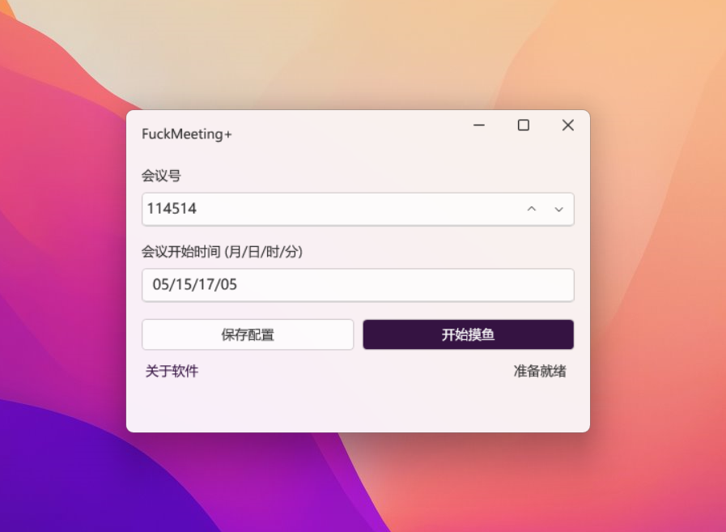

# FuckMeeting+

FuckMeeting+ 是 [FuckTencentMeeting](https://github.com/Yoroion/FuckTencentMeeting) 的 GUI 重構版，是基於 .NET 6.0 的極簡 WPF 軟體，用於自動加入騰訊會議

下文簡稱為 **FM+**

## 特性

- 騰訊會議定時自動入會
- Fluent Design
- 自帶 .NET 桌面運行時 (可選)
- MVVM [^1]

[^1]: 由 Microsoft Community Toolkit 支援，結構比較簡單，但也算是 MVVM 吧...

## 下載 FM+

FM+ 的發布模式為**獨立版**與**依賴框架版**同時發布

如果你的 PC 安裝了 .NET 運行時，推薦使用體積更小的依賴框架版

下載鏈接在 GitHub [Releases](https://github.com/Yoroion/FuckMeetingPlus/releases) 中

## 截圖展示

## 使用教程

最新的 **2.2.0** 版本采用了 URL 協議啟動騰訊會議，毋再需要屏幕坐標

1. 填寫騰訊會議號碼

2. 填寫符合格式的預定時間，月/日/時/分，如 `08/31/09/00`

3. 保存配置

4. 盡情享用，開始摸魚！

## 註意事項

- 點擊 ⌈開始摸魚⌋ 按鈕後，如果想要取消任務，點擊右上角的 `×` 關閉即可，FM+ 不會進駐系統後臺
- FM+ 檢查當前時間是否到達預定時間的周期為 30 秒

## 鳴謝

- [Microsoft.Toolkit.MVVM](https://github.com/CommunityToolkit/WindowsCommunityToolkit)
- [H.InputSimulater](https://github.com/HavenDV/H.InputSimulator)
- [WPF UI](https://github.com/lepoco/wpfui)
- [ReSharper](https://www.jetbrains.com/resharper/)

以及所有支持本項目的朋友，你們的 Star 將幫助 FM+ 這個超微小項目走得更遠

## 開發環境要求

如果你想要自行修改 FM+ 或者為 FM+ 貢獻代碼，你需要安裝 Visual Studio 2022  及 .NET SDK 6.0

當然，如果你覺得寫得太💩或者哪個地方需要改進，歡迎指出

## 協議

FM+ 基於 AGPL v3 協議開源，修改後需要保留原作者的版權信息，查看 [協議條款](./LICENSE.txt)

