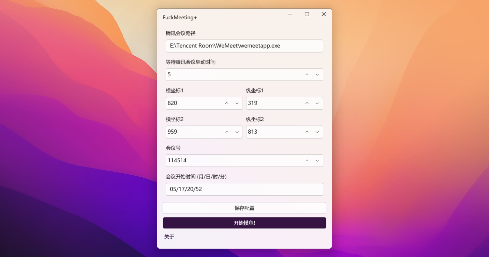
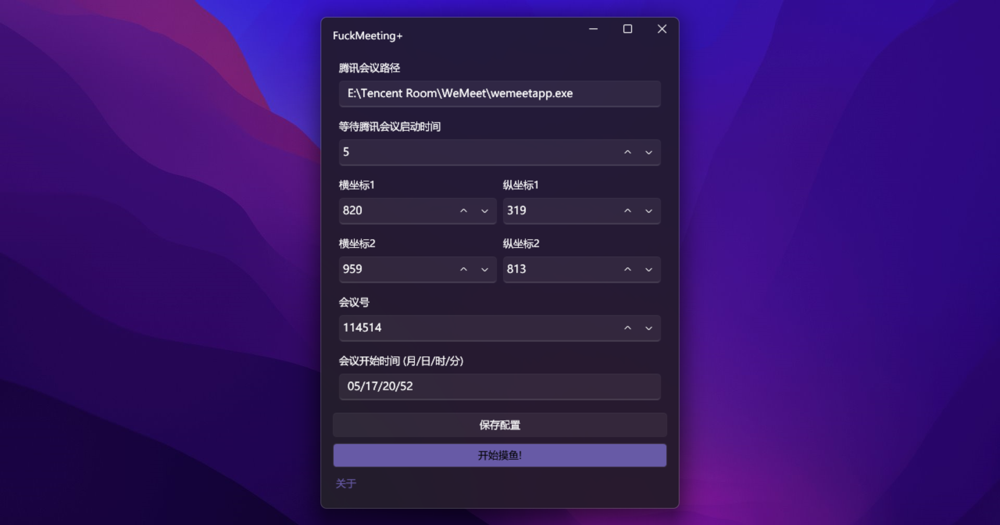

# FuckMeeting+

腾讯会议自动入会 **FuckMeeting+** 是 [FuckTencentMeeting](https://github.com/Yoroion/FuckTencentMeeting) 的重构升级版，遵循 Windows11 风格的 Fluent Design，是基于 .NET 6.0 的 WPF 应用，下文简称为 **FM+**

## 📷 截图展示

## ✨ 特性

- 腾讯会议定时自动入会
- 用户配置保存
- 基于 Timer 调度
- Fluent Design / Mica 效果
- 浅色 / 深色模式
- 自带 .NET 桌面运行时 (可选)
- MVVM 架构

## ⬇️ 下载 FM+

FM+ 的发布模式为**独立版**与**依赖框架版**同时发布，如果你的 PC 安装了 .NET 运行时，推荐使用体积更小的依赖框架版

下载链接在 GitHub [Releases]([Releases · Yoroion/FuckMeetingPlus (github.com)](https://github.com/Yoroion/FuckMeetingPlus/releases)) 中

## ⚒️ 使用教程

1. 填写**合法的**腾讯会议安装路径，如 `E:\Tencent Room\WeMeet\wemeetapp.exe`
2. 填写腾讯会议的启动时间，单位为**秒**。这个数值取决于您的计算机配置
3. 使用 *Snipaste* 等软件获取需要点击的坐标，并在 FM+ 中填写。共计**两个**坐标，代表着将要点击的**加入会议**按钮
4. 填写腾讯会议号码
5. 填写**符合格式的**预定时间，月/日/时/分，如 `08/31/09/00`
6. 单击**保存配置**
7. 尽情享用，开始摸鱼！

## ⚠️ 注意事项

- 点击 ⌈开始摸鱼⌋ 按钮后，如果您想要取消任务，点击左上角的 × 关闭即可，FM+ 不会进驻您的系统后台
- 请务必保证填写的路径和预定时间符合格式
- FM+ 检查当前时间是否到达预定时间的周期为 30 秒

## ❤️ 鸣谢

- [Microsoft.Toolkit.MVVM](https://github.com/CommunityToolkit/WindowsCommunityToolkit)
- [H.InputSimulater](https://github.com/HavenDV/H.InputSimulator)
- [WPFUI](https://github.com/lepoco/wpfui)
- [ReSharper](https://www.jetbrains.com/resharper/)

以及所有支持本项目的朋友，你们的 Star 将帮助 FM+ 这个小项目走得更远

## 🔨 开发环境要求

如果你想要自行修改 FM+ 或者为 FM+ 贡献代码，你需要安装 Visual Studio 2022 及 .NET SDK 6.0

你可能还需要了解一些 C# 和 XAML 的基础知识

当然，如果你觉得作者写得太烂或者哪个地方需要改进，欢迎指出

## ⚖️ 协议

FM+ 基于 AGPL v3 协议开源，修改后需要保留原作者的版权信息，查看 [协议条款](./LICENSE.txt)

