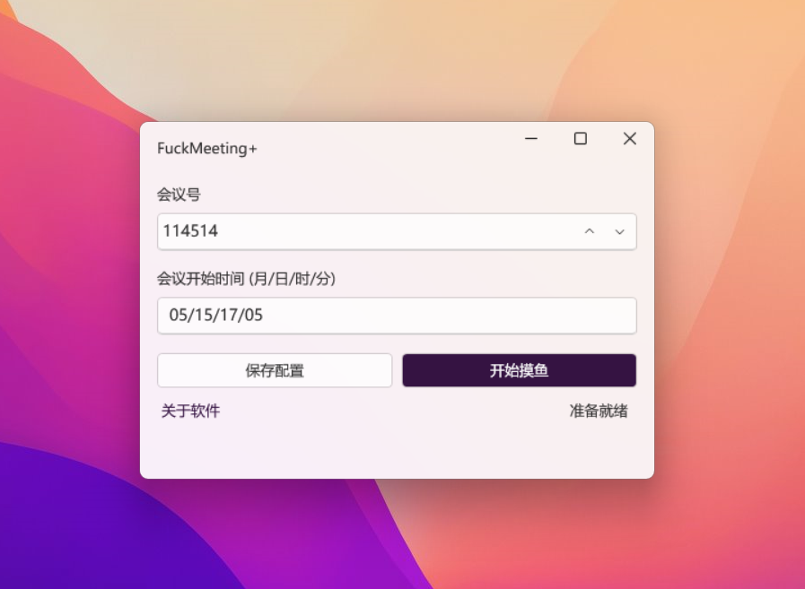

# FuckMeeting+

FuckMeeting+ 是 [FuckTencentMeeting](https://github.com/Yoroion/FuckTencentMeeting) 的 GUI 重构版，是基于 .NET 6.0 的极简 WPF 应用，用于自动加入腾讯会议，下文简称为 **FM+**

简体中文 | [繁体中文](https://github.com/Yoroion/FuckMeetingPlus/blob/master/README%20_TC.md)

## 特性

- 腾讯会议定时自动入会
- Fluent Design
- 自带 .NET 桌面运行时 (可选)
- MVVM [^1]

[^1]: 由 Microsoft Community Toolkit 提供支持，结构比较简单，但也算是 MVVM 吧...

## 下载 FM+

FM+ 的发布模式为**独立版**与**依赖框架版**同时发布

如果你的 PC 安装了 .NET 运行时，推荐使用体积更小的依赖框架版

下载链接在 GitHub [Releases](https://github.com/Yoroion/FuckMeetingPlus/releases) 中

## 截图展示

## 使用教程

最新的 **2.2.0** 版本采用了 URL 协议启动腾讯会议，不再需要屏幕坐标

1. 填写腾讯会议号码

2. 填写符合格式的预定时间，月/日/时/分，如 `08/31/09/00`

3. 保存配置

4. 尽情享用，开始摸鱼！

## 注意事项

- 点击 ⌈开始摸鱼⌋ 按钮后，如果您想要取消任务，点击右上角的 `×` 关闭即可，FM+ 不会进驻系统后台
- FM+ 检查当前时间是否到达预定时间的周期为 30 秒

## 鸣谢

- [Microsoft.Toolkit.MVVM](https://github.com/CommunityToolkit/WindowsCommunityToolkit)
- [H.InputSimulater](https://github.com/HavenDV/H.InputSimulator)
- [WPF UI](https://github.com/lepoco/wpfui)
- [ReSharper](https://www.jetbrains.com/resharper/)

以及所有支持本项目的朋友，你们的 Star 将帮助 FM+ 这个超微小项目走得更远

## 开发环境要求

如果你想要自行修改 FM+ 或者为 FM+ 贡献代码，你需要安装 Visual Studio 2022 及 .NET SDK 6.0

当然，如果你觉得写得太💩或者哪个地方需要改进，欢迎指出

## 协议

FM+ 基于 AGPL v3 协议开源，修改后需要保留原作者的版权信息，查看 [协议条款](./LICENSE.txt)

